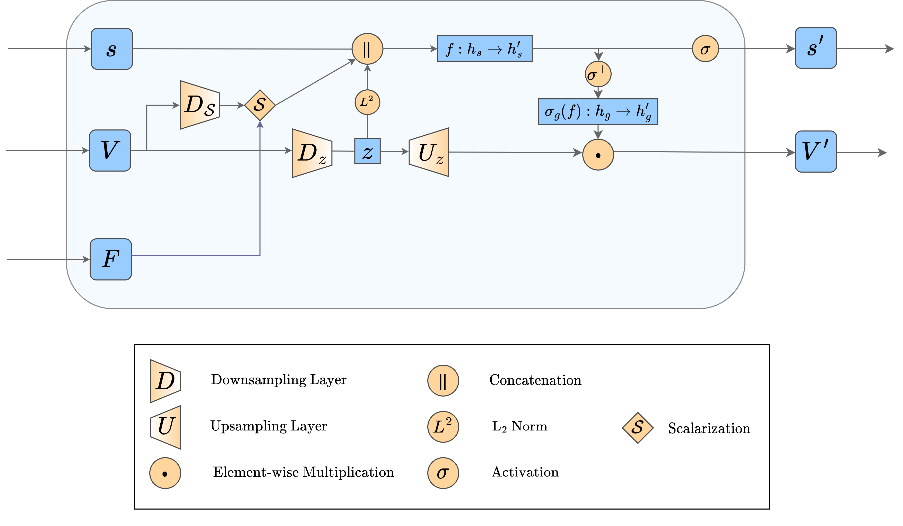

<div align="center">

# GCPNet

<a href="https://pytorch.org/get-started/locally/"></a>
<a href="https://pytorchlightning.ai/"></a>
<a href="https://hydra.cc/"></a>
<!-- [](https://www.nature.com/articles/nature14539) -->
<!-- [](https://papers.nips.cc/paper/2020) -->



</div>

## Description

A PyTorch implementation of Geometry-Complete SE(3)-Equivariant Perceptron Networks (GCPNets)

## How to run

Install dependencies

```bash
# clone project
git clone https://github.com/BioinfoMachineLearning/GCPNet
cd gcpnet/

# create conda environment
conda env create -f environment.yaml
conda activate gcpnet
```

Download data
```bash
# initialize data directory structure
mkdir -p data
mkdir -p data/ATOM3D
mkdir -p data/ATOM3D/LBA
mkdir -p data/ATOM3D/PSR

# fetch, extract, and clean-up preprocessed data
cd data/
wget https://zenodo.org/record/7293186/files/NMS.tar.gz
tar -xzf NMS.tar.gz
rm NMS.tar.gz
cd ../
```

**Note**: The ATOM3D datasets we use (i.e., the LBA and PSR datasets) will automatically be downloaded during execution of `src/train.py` or `src/eval.py` if they have not already been downloaded.

## How to train

Train model with default configuration

```bash
# train on CPU
python3 src/train.py trainer=cpu

# train on GPU
python3 src/train.py trainer=gpu
```

Train model with chosen experiment configuration from [configs/experiment/](configs/experiment/)

```bash
python3 src/train.py experiment=experiment_name.yaml
```

Train a model for the ligand-binding affinity (**LBA**) task

```bash
python3 src/train.py experiment=gcpnet_lba.yaml
```

Train a model for the protein structure ranking (**PSR**) task

```bash
python3 src/train.py experiment=gcpnet_psr.yaml
```

Train a model for one of the Newtonian many-body system (**NMS**) tasks

```bash
python3 src/train.py experiment=gcpnet_nms_{small/small_20body/static/dynamic}.yaml
```

**Note**: You can override any parameter from command line like this

```bash
python3 src/train.py trainer.max_epochs=20 datamodule.batch_size=64
```

## How to evaluate
Reproduce our results for the LBA task

```bash
lba_model_1_ckpt_path="checkpoints/LBA/model_1_epoch_205_rmse_1_352_pearson_0_612_spearman_0_609.ckpt"
lba_model_2_ckpt_path="checkpoints/LBA/model_2_epoch_188_rmse_1_349_pearson_0_607_spearman_0_613.ckpt"
lba_model_3_ckpt_path="checkpoints/LBA/model_3_epoch_186_rmse_1_355_pearson_0_604_spearman_0_598.ckpt"

python3 src/eval.py datamodule=atom3d_lba model=gcpnet_lba logger=csv trainer.accelerator=gpu trainer.devices=1 ckpt_path="$lba_model_1_ckpt_path"
python3 src/eval.py datamodule=atom3d_lba model=gcpnet_lba logger=csv trainer.accelerator=gpu trainer.devices=1 ckpt_path="$lba_model_2_ckpt_path"
python3 src/eval.py datamodule=atom3d_lba model=gcpnet_lba logger=csv trainer.accelerator=gpu trainer.devices=1 ckpt_path="$lba_model_3_ckpt_path"
```

```bash
LBA Model 1
┏━━━━━━━━━━━━━━━━━━━━━━━━━━━┳━━━━━━━━━━━━━━━━━━━━━━━━━━━┓
┃        Test metric        ┃       DataLoader 0        ┃
┡━━━━━━━━━━━━━━━━━━━━━━━━━━━╇━━━━━━━━━━━━━━━━━━━━━━━━━━━┩
│   test/PearsonCorrCoef    │    0.6116969585418701     │
│         test/RMSE         │    1.3517177104949951     │
│   test/SpearmanCorrCoef   │    0.6094594597816467     │
│         test/loss         │    1.8178036212921143     │
└───────────────────────────┴───────────────────────────┘

LBA Model 2
┏━━━━━━━━━━━━━━━━━━━━━━━━━━━┳━━━━━━━━━━━━━━━━━━━━━━━━━━━┓
┃        Test metric        ┃       DataLoader 0        ┃
┡━━━━━━━━━━━━━━━━━━━━━━━━━━━╇━━━━━━━━━━━━━━━━━━━━━━━━━━━┩
│   test/PearsonCorrCoef    │    0.6073298454284668     │
│         test/RMSE         │    1.3492789268493652     │
│   test/SpearmanCorrCoef   │    0.6127785444259644     │
│         test/loss         │     1.812593936920166     │
└───────────────────────────┴───────────────────────────┘

LBA Model 3
┏━━━━━━━━━━━━━━━━━━━━━━━━━━━┳━━━━━━━━━━━━━━━━━━━━━━━━━━━┓
┃        Test metric        ┃       DataLoader 0        ┃
┡━━━━━━━━━━━━━━━━━━━━━━━━━━━╇━━━━━━━━━━━━━━━━━━━━━━━━━━━┩
│   test/PearsonCorrCoef    │    0.6037312150001526     │
│         test/RMSE         │     1.35466730594635      │
│   test/SpearmanCorrCoef   │    0.5983302593231201     │
│         test/loss         │    1.8261266946792603     │
└───────────────────────────┴───────────────────────────┘
```

Reproduce our results for the PSR task

```bash
psr_model_ckpt_path="checkpoints/PSR/model_epoch_115_localpearson_0_616_localspearman_0_532_localkendall_0_385_globalpearson_0_871_globalspearman_0_869_globalkendall_0_676.ckpt"

python3 src/eval.py datamodule=atom3d_psr model=gcpnet_psr logger=csv trainer.accelerator=gpu trainer.devices=1 ckpt_path="$psr_model_ckpt_path"
```

```bash
PSR Model
┏━━━━━━━━━━━━━━━━━━━━━━━━━━━━━┳━━━━━━━━━━━━━━━━━━━━━━━━━━━━━┓
┃         Test metric         ┃        DataLoader 0         ┃
┡━━━━━━━━━━━━━━━━━━━━━━━━━━━━━╇━━━━━━━━━━━━━━━━━━━━━━━━━━━━━┩
│    test/GlobalKendallTau    │     0.6764563159385293      │
│ test/GlobalPearsonCorrCoef  │     0.8706125931497829      │
│ test/GlobalSpearmanCorrCoef │     0.8685365401327472      │
│    test/LocalKendallTau     │     0.3854801857584887      │
│  test/LocalPearsonCorrCoef  │     0.6155098974748984      │
│ test/LocalSpearmanCorrCoef  │     0.5341097968923214      │
│          test/loss          │     0.01934020034968853     │
└─────────────────────────────┴─────────────────────────────┘
```

Reproduce our results for each of the NMS tasks

```bash
nms_small_model_ckpt_path="checkpoints/NMS/NMS_Small/model_epoch_9977_mse_0_0070.ckpt"
nms_small_20body_model_ckpt_path="checkpoints/NMS/NMS_Small_20Body/model_epoch_10087_mse_0_0071.ckpt"
nms_static_model_ckpt_path="checkpoints/NMS/NMS_Static/model_epoch_5159_mse_0_0073.ckpt"
nms_dynamic_model_ckpt_path="checkpoints/NMS/NMS_Dynamic/model_epoch_9825_mse_0_0173.ckpt"

python3 src/eval.py datamodule=nms datamodule.data_mode=small model=gcpnet_nms logger=csv trainer.accelerator=gpu trainer.devices=1 ckpt_path="$nms_small_model_ckpt_path"
python3 src/eval.py datamodule=nms datamodule.data_mode=small_20body model=gcpnet_nms logger=csv trainer.accelerator=gpu trainer.devices=1 ckpt_path="$nms_small_20body_model_ckpt_path"
python3 src/eval.py datamodule=nms datamodule.data_mode=static model=gcpnet_nms logger=csv trainer.accelerator=gpu trainer.devices=1 ckpt_path="$nms_static_model_ckpt_path"
python3 src/eval.py datamodule=nms datamodule.data_mode=dynamic model=gcpnet_nms logger=csv trainer.accelerator=gpu trainer.devices=1 ckpt_path="$nms_dynamic_model_ckpt_path"
```

```bash
NMS Small Model
┏━━━━━━━━━━━━━━━━━━━━━━━━━━━┳━━━━━━━━━━━━━━━━━━━━━━━━━━━┓
┃        Test metric        ┃       DataLoader 0        ┃
┡━━━━━━━━━━━━━━━━━━━━━━━━━━━╇━━━━━━━━━━━━━━━━━━━━━━━━━━━┩
│         test/RMSE         │    0.08386920392513275    │
│         test/loss         │   0.007034041918814182    │
└───────────────────────────┴───────────────────────────┘

NMS Small 20-Body Model
┏━━━━━━━━━━━━━━━━━━━━━━━━━━━┳━━━━━━━━━━━━━━━━━━━━━━━━━━━┓
┃        Test metric        ┃       DataLoader 0        ┃
┡━━━━━━━━━━━━━━━━━━━━━━━━━━━╇━━━━━━━━━━━━━━━━━━━━━━━━━━━┩
│         test/RMSE         │    0.08451084792613983    │
│         test/loss         │   0.007142083253711462    │
└───────────────────────────┴───────────────────────────┘

NMS Static Model
┏━━━━━━━━━━━━━━━━━━━━━━━━━━━┳━━━━━━━━━━━━━━━━━━━━━━━━━━━┓
┃        Test metric        ┃       DataLoader 0        ┃
┡━━━━━━━━━━━━━━━━━━━━━━━━━━━╇━━━━━━━━━━━━━━━━━━━━━━━━━━━┩
│         test/RMSE         │    0.08549366146326065    │
│         test/loss         │    0.00730916578322649    │
└───────────────────────────┴───────────────────────────┘

NMS Dynamic Model
┏━━━━━━━━━━━━━━━━━━━━━━━━━━━┳━━━━━━━━━━━━━━━━━━━━━━━━━━━┓
┃        Test metric        ┃       DataLoader 0        ┃
┡━━━━━━━━━━━━━━━━━━━━━━━━━━━╇━━━━━━━━━━━━━━━━━━━━━━━━━━━┩
│         test/RMSE         │    0.13143806159496307    │
│         test/loss         │   0.017275962978601456    │
└───────────────────────────┴───────────────────────────┘
```
